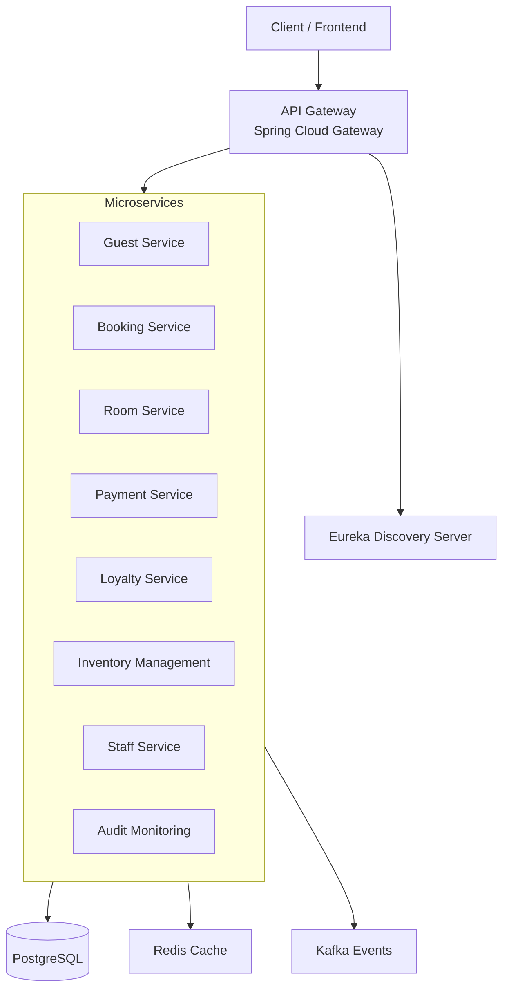

# Agoda Microservices

**A Spring Boot microservices-based Hotel Management System** inspired by Agoda’s booking platform.

This project has been migrated from a reactive stack (WebFlux + R2DBC) to **standard Spring Boot with Spring Data JPA + PostgreSQL** for improved simplicity, maintainability, and development experience.

---

## Architecture



## 🚀 Tech Stack

- **Java 21**
- **Spring Boot 3.2+**
- **Spring Data JPA** + **Hibernate**
- **Spring Web MVC**
- **Spring Cloud** (Eureka, Gateway, OpenFeign, Resilience4j)
- **PostgreSQL** (All services)
- **Redis** (Caching)
- **Kafka** (Event-Driven Architecture)
- **Maven** + **Docker**

## 📦 Services

| Service                | Port  | Key Technologies                     | Database      |
|------------------------|-------|--------------------------------------|---------------|
| `discovery-server`     | 8761  | Eureka Server                        | -             |
| `api-gateway`          | 8080  | Spring Cloud Gateway                 | -             |
| `Guest-Service`        | 8081  | Spring MVC, JPA, OpenFeign           | PostgreSQL    |
| `booking-service`      | 8082  | JPA, Redis, Kafka                    | PostgreSQL    |
| `room-service`         | 8083  | JPA, Caching                         | PostgreSQL    |
| `payment-service`      | 8084  | JPA, Transactions                    | PostgreSQL    |
| `Loyalty-Service`      | 8085  | JPA                                  | PostgreSQL    |
| `inventory-management` | 8087  | JPA                                  | PostgreSQL    |
| `staff-service`        | 8088  | JPA                                  | PostgreSQL    |
| `audit-monitoring`     | 8089  | Kafka                                | PostgreSQL    |

## 🚀 Quick Start

### Prerequisites
- Java 21
- Maven 3.9+
- Docker & Docker Compose
- PostgreSQL (via Docker recommended)

### Option 1: Docker Compose (Recommended)

```bash
git clone https://github.com/VicheaStack/Agoda-Microservice.git
cd Agoda-Microservice
docker compose up -d --build
```

### Option 2: Local Development

```bash
# Start PostgreSQL and Redis
docker run -d -p 5432:5432 --name postgres \
  -e POSTGRES_PASSWORD=password \
  -e POSTGRES_DB=hotel_db postgres:16

docker run -d -p 6379:6379 redis:7-alpine

# Run services (one by one)
cd discovery-server && ./mvnw spring-boot:run
cd ../api-gateway && ./mvnw spring-boot:run
cd ../Guest-Service && ./mvnw spring-boot:run
# Repeat for other services
```

## 🔧 Configuration Example (`application.yml`)

```yaml
server:
  port: 8081

spring:
  application:
    name: guest-service
  datasource:
    url: jdbc:postgresql://localhost:5432/hotel_db
    username: postgres
    password: password
    driver-class-name: org.postgresql.Driver
  jpa:
    hibernate:
      ddl-auto: update
    show-sql: true
    properties:
      hibernate:
        dialect: org.hibernate.dialect.PostgreSQLDialect
  data:
    redis:
      host: localhost
      port: 6379

eureka:
  client:
    service-url:
      defaultZone: http://localhost:8761/eureka/
```

## 📁 Project Structure (Example - Guest-Service)

```
Guest-Service/
├── src/main/java/com/group/learn/guest/
│   ├── controller/          # @RestController
│   ├── service/             # Business logic
│   ├── repository/          # JpaRepository interfaces
│   ├── client/              # OpenFeign clients
│   ├── dto/                 # Data Transfer Objects
│   ├── entity/              # @Entity classes
│   ├── exception/
│   └── config/
├── src/main/resources/application.yml
├── Dockerfile
└── pom.xml
```

## 🔌 API Example

```java
@RestController
@RequestMapping("/api/guests")
@RequiredArgsConstructor
public class GuestController {

    private final GuestService guestService;
    private final BookingClient bookingClient; // OpenFeign

    @GetMapping
    public List<GuestDTO> getAllGuests() {
        return guestService.findAll();
    }

    @GetMapping("/{id}")
    public GuestDTO getGuestById(@PathVariable Long id) {
        return guestService.findById(id);
    }

    @PostMapping
    public GuestDTO createGuest(@Valid @RequestBody GuestDTO guestDTO) {
        return guestService.create(guestDTO);
    }
}
```

## 🧪 Testing

```java
@SpringBootTest
@AutoConfigureMockMvc
class GuestControllerTest {

    @Autowired
    private MockMvc mockMvc;

    @Test
    void getAllGuests_ShouldReturnOk() throws Exception {
        mockMvc.perform(get("/api/guests"))
               .andExpect(status().isOk());
    }
}
```

## 📊 Monitoring

- Health: `/actuator/health`
- Metrics: `/actuator/metrics`
- OpenFeign + Resilience4j dashboards

## 🚢 Deployment

Each service includes a production-ready `Dockerfile`:

```dockerfile
FROM openjdk:21-jdk-slim
WORKDIR /app
COPY target/*.jar app.jar
EXPOSE 8081
ENTRYPOINT ["java", "-jar", "app.jar"]
```

## 🤝 Contributing

- Use **Spring Data JPA** with PostgreSQL
- Follow `com.group.learn.*` package naming
- Prefer OpenFeign for inter-service communication
- Write clear tests with `MockMvc`

## 📄 License

Apache License 2.0

---

**Made by [VicheaStack](https://github.com/VicheaStack)**

```

Copy and paste everything above into your `README.md` file.

Let me know if you want any final adjustments!
