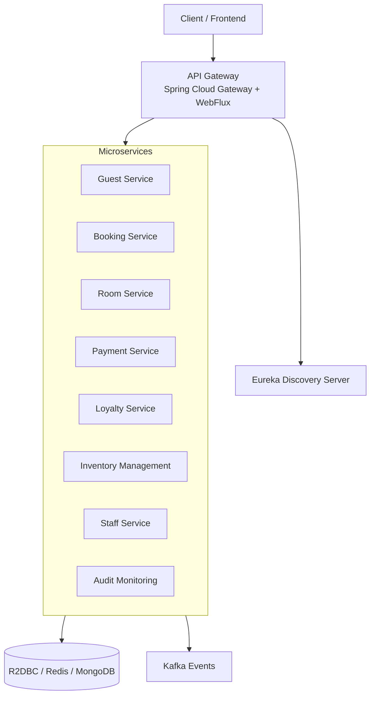

# Agoda Microservices

**A modern reactive hotel management microservices platform** inspired by Agoda’s booking system.

Built with **Spring Boot 3**, **Java 21**, **WebFlux**, and **Project Reactor** for fully non-blocking, high-performance operations.

---

## Recent Update
- **OpenFeign Migration** (July 2026): Replaced reactive `WebClient` with **Spring Cloud OpenFeign** + Resilience4j for improved maintainability, retries, and circuit breaking.

## 🏗️ Architecture



## 🚀 Tech Stack

- **Java 21** (Virtual Threads, Records, Pattern Matching)
- **Spring Boot 3.2+** + **Spring WebFlux**
- **Project Reactor** (`Mono` / `Flux`)
- **Spring Cloud** (Eureka, Gateway, OpenFeign, Resilience4j)
- **R2DBC** (MySQL / PostgreSQL)
- **Reactive Redis** & **Reactive MongoDB**
- **Kafka** (Reactive Streams)
- **Docker** + **Docker Compose**

## 📦 Services

| Service                | Port  | Key Technologies                     | Database          |
|------------------------|-------|--------------------------------------|-------------------|
| `discovery-server`     | 8761  | Eureka Server                        | -                 |
| `api-gateway`          | 8080  | Spring Cloud Gateway, WebFlux        | -                 |
| `Guest-Service`        | 8081  | WebFlux, OpenFeign, R2DBC            | MySQL             |
| `booking-service`      | 8082  | Redis, Kafka                         | MySQL + Redis     |
| `room-service`         | 8083  | R2DBC, Caching                       | PostgreSQL        |
| `payment-service`      | 8084  | Reactive Transactions                | MySQL             |
| `Loyalty-Service`      | 8085  | R2DBC                                | PostgreSQL        |
| `inventory-management` | 8087  | R2DBC                                | MySQL             |
| `staff-service`        | 8088  | R2DBC                                | PostgreSQL        |
| `audit-monitoring`     | 8089  | Reactive Kafka                       | Elasticsearch     |

## 🚀 Quick Start

### Prerequisites
- Java 21
- Maven 3.9+
- Docker & Docker Compose (recommended)

### Option 1: Docker Compose (Recommended)

```bash
git clone https://github.com/VicheaStack/Agoda-Microservice.git
cd Agoda-Microservice
docker compose up -d --build
```

### Option 2: Run Locally

```bash
# Start databases first
docker run -d -p 3306:3306 --name mysql -e MYSQL_ROOT_PASSWORD=reactivepass mysql:8.0
docker run -d -p 6379:6379 redis:7-alpine

# Run services (in separate terminals)
cd discovery-server && ./mvnw spring-boot:run
cd ../api-gateway && ./mvnw spring-boot:run
cd ../Guest-Service && ./mvnw spring-boot:run
# ... repeat for other services
```

## 🔧 Configuration Example (`application.yml`)

```yaml
server:
  port: 8081

spring:
  application:
    name: guest-service
  r2dbc:
    url: r2dbc:mysql://localhost:3306/hotel_db
    username: root
    password: reactivepass
  threads:
    virtual:
      enabled: true

eureka:
  client:
    service-url:
      defaultZone: http://localhost:8761/eureka/

spring:
  cloud:
    openfeign:
      circuitbreaker:
        enabled: true
```

## 📁 Project Structure (Example - Guest-Service)

```
Guest-Service/
├── src/main/java/com/group/learn/guest/
│   ├── controller/
│   ├── service/
│   ├── repository/      # Reactive repositories
│   ├── client/          # OpenFeign clients
│   ├── dto/
│   ├── entity/
│   └── config/
├── src/main/resources/application.yml
├── Dockerfile
└── pom.xml
```

## 🔌 API Example

```java
@RestController
@RequestMapping("/api/guests")
@RequiredArgsConstructor
public class GuestController {

    private final GuestService guestService;
    private final BookingClient bookingClient; // OpenFeign

    @GetMapping(produces = MediaType.TEXT_EVENT_STREAM_VALUE)
    public Flux<GuestDTO> getAll() {
        return guestService.findAll();
    }
}
```

## 🧪 Testing

```java
@SpringBootTest
@AutoConfigureWebTestClient
class GuestControllerTest {

    @Autowired
    private WebTestClient webTestClient;

    @Test
    void getAllGuests_ShouldReturnFlux() {
        webTestClient.get().uri("/api/guests")
            .accept(MediaType.TEXT_EVENT_STREAM)
            .exchange()
            .expectStatus().isOk();
    }
}
```

## 📊 Monitoring

- Health: `http://localhost:8081/actuator/health`
- Metrics: `http://localhost:8081/actuator/metrics`
- Circuit Breakers & Virtual Threads metrics available

## 🚢 Deployment

Each service includes a ready-to-use `Dockerfile` optimized for Java 21.

## 🤝 Contributing

1. Follow `com.group.learn.*` package structure
2. Prefer reactive patterns (`Mono`/`Flux`)
3. Use OpenFeign for inter-service communication
4. Add tests with `WebTestClient`
5. Update this README when adding new features

## 📄 License

Apache License 2.0 — see [LICENSE](LICENSE) file.

---

**Made by [VicheaStack](https://github.com/VicheaStack)** — Modern Java & Reactive Systems.

```

Just copy everything above (including the first ```markdown:disable-run

Would you like any last tweaks before you use it?
```
